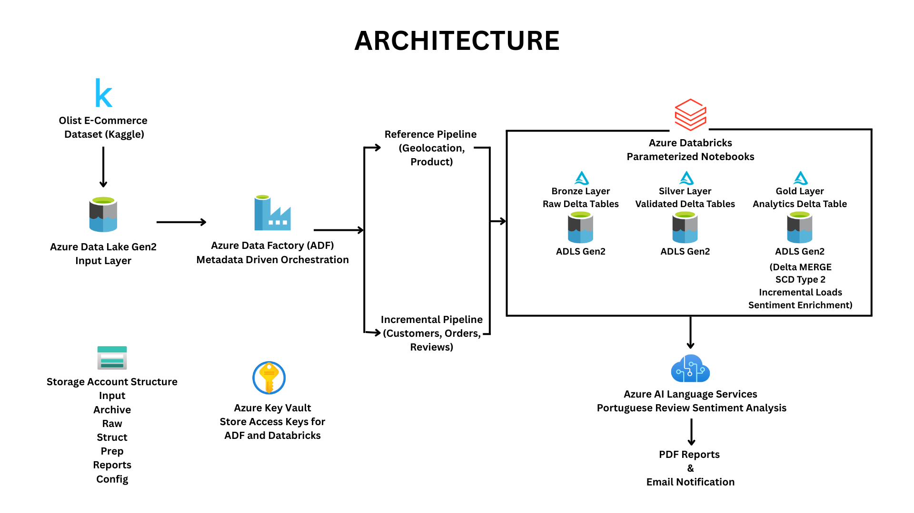

# Azure End-to-End E-Commerce Data Platform

## Project Overview

This project demonstrates the design and implementation of a metadata-driven Azure Data Engineering solution using the Olist Brazilian E-Commerce Dataset. The platform ingests, validates, transforms, enriches, and serves e-commerce data using a Medallion Architecture built on Azure services.

The solution supports both reference and incremental data processing, implements Slowly Changing Dimension (SCD Type 2) logic, performs Portuguese sentiment analysis using Azure AI Language Services, and generates automated PDF reports with email notifications.

---

## Solution Architecture



### Architecture Highlights

- Metadata-driven orchestration using Azure Data Factory
- Separate Reference and Incremental pipelines
- Medallion Architecture (Bronze, Silver, Gold)
- Delta Lake implementation across all layers
- SCD Type 2 processing for customer dimension tracking
- Incremental data processing using Delta MERGE
- Azure AI-powered Portuguese sentiment analysis
- Automated PDF report generation
- Email notification framework
- Secure credential management using Azure Key Vault

---

## Business Problem

E-commerce platforms generate large volumes of transactional and customer data that require:

- Historical tracking of customer information
- Incremental processing of new data
- Data quality validation
- Customer sentiment analysis
- Automated reporting
- Secure and scalable data pipelines

This project addresses these challenges using Azure-native services and modern data engineering practices.

---

## Dataset

**Source:** ([Olist Brazilian E-Commerce Dataset](https://www.kaggle.com/datasets/olistbr/brazilian-ecommerce))

Dataset includes:

- Customers
- Orders
- Order Items
- Payments
- Reviews
- Sellers
- Products
- Geolocation
- Product Category Translation

To simulate real-world ingestion patterns:

- Dataset was split into 2017 and 2018 batches
- Customer dimension records were modified to demonstrate SCD Type 2 implementation
- Data was categorized into:
  - Reference Data
  - Incremental Data

---

## Azure Services Used

| Service | Purpose |
|----------|----------|
| Azure Data Lake Storage Gen2 | Data storage |
| Azure Data Factory | Metadata-driven orchestration |
| Azure Databricks | Data transformation and processing |
| Azure Key Vault | Secret and credential management |
| Azure AI Language Service | Portuguese sentiment analysis |

---

## Storage Architecture

### Main Storage Structure

```text
input/
archive/
raw/
struct/
prep/
reports/
config/
```

### Reference Storage Structure

```text
ref/
├── input/
├── archive/
├── raw/
├── struct/
├── prep/
└── config/
```

### Folder Description

| Folder | Purpose |
|---------|----------|
| `input` | Incoming source files received from the Olist dataset |
| `archive` | Successfully processed files archived for audit and recovery purposes |
| `raw` | Bronze layer containing raw Delta tables with minimal transformations |
| `struct` | Silver layer containing validated and transformed Delta tables |
| `prep` | Gold layer containing analytics-ready Delta tables |
| `reports` | Generated PDF reports and analytical outputs |
| `config` | Configuration files, metadata definitions and last-run tracking files |
| `ref` | Storage area for reference datasets such as Product and Geolocation data |

---

# Data Processing Architecture

## Reference Pipeline

Processes relatively static datasets:

- Geolocation
- Product
- Product Category Translation

Characteristics:

- Executed once during initial load
- Low frequency updates
- Metadata-driven ingestion
- Automated validation and archival

---

## Incremental Pipeline

Processes transactional datasets:

- Customers
- Orders
- Order Items
- Payments
- Reviews
- Sellers

Characteristics:

- Historical processing (2017)
- Incremental processing (2018)
- Delta MERGE operations
- SCD Type 2 implementation
- Automated report generation

---

# Azure Data Factory Orchestration

The pipeline follows a metadata-driven framework.

## Workflow

### Step 1

Read configuration metadata from config file.

### Step 2

Validate whether all expected source files are available.

### Step 3

Wait until all required files arrive.

### Step 4

Read last successful execution metadata.

### Step 5

Determine processing year.

### Step 6

Validate incoming data period against last processed period.

### Step 7

Execute parameterized Databricks workflow.

### Step 8

Generate analytical report.

### Step 9

Send success or failure notification.

### Step 10

Move processed files to archive.

---

## Medallion Architecture

### Bronze Layer

Purpose:

- Raw ingestion layer
- Exact source representation
- Delta tables

Key Activities:

- Schema standardization
- Metadata capture
- Data ingestion

Output:

```text
Raw Delta Tables
```

---

### Silver Layer

Purpose:

- Data cleansing
- Data validation
- Standardized business entities

Key Activities:

- Null handling
- Data quality checks
- Deduplication
- Type standardization

Output:

```text
Validated Delta Tables
```

---

### Gold Layer

Purpose:

- Business-ready analytical datasets

Key Activities:

- Delta MERGE operations
- Incremental processing
- SCD Type 2 implementation
- Sentiment enrichment

Output:

```text
Analytics Delta Tables
```

---

# SCD Type 2 Implementation

Customer dimension records were intentionally modified across data batches to demonstrate historical tracking.

Features:

- Surrogate key generation
- Effective start date
- Effective end date
- Current record flag
- Historical record preservation

Business Benefit:

Track customer attribute changes over time without losing historical information.

---

# Incremental Processing Framework

Implemented using:

- Last-run metadata tracking
- Delta MERGE
- Config-driven processing
- Dynamic execution logic

Benefits:

- Reduced processing time
- Reduced compute costs
- Scalable architecture
- Production-ready design

---

# Sentiment Analysis

Customer review text is processed using Azure AI Language Services.

Features:

- Portuguese language support
- Positive sentiment detection
- Negative sentiment detection
- Neutral sentiment detection

Output:

- Sentiment score
- Sentiment classification

Business Value:

Provides insights into customer satisfaction and product performance.

---

# Security

Azure Key Vault is used to securely manage:

- Storage Account Access Keys
- Service Principal Credentials
- Azure AI Credentials
- Pipeline Secrets

Benefits:

- No hardcoded credentials
- Centralized secret management
- Improved security posture

---

# Reporting

The pipeline automatically generates:

- Business summary reports
- Sentiment analysis reports
- Processing statistics

Reports are:

- Exported as PDF
- Stored in reports folder
- Delivered via email notifications

---

# Project Features

- Metadata-driven orchestration
- Parameterized Azure Data Factory pipelines
- Parameterized Databricks notebooks
- Delta Lake architecture
- Medallion architecture implementation
- SCD Type 2
- Incremental processing
- Portuguese sentiment analysis
- Azure Key Vault integration
- Automated archival framework
- PDF reporting
- Email notifications

---

# Repository Structure

```text
azure-ecommerce-data-platform/
│
├── README.md
│
├── architecture/
│   ├── architecture.png
│   ├── incremental_pipeline.png
│   └── reference_pipeline.png
│
├── datasets/
│   ├── incremental/
│   │   ├── 2017/
│   │   └── 2018/
│   │
│   └── reference/
│       ├── geolocation.csv
│       ├── products.csv
│       └── product_category_translation.csv
│
├── adf/
│   ├── incremental_pipeline.json
│   └── reference_pipeline.json
│
├── databricks/
│   ├── notebooks/
│   └── dbc_export/
│
├── reports/
│   ├── ecom_dashboard_2017.pdf
│   └── ecom_dashboard_2018.pdf
│
└── screenshots/
    ├── success_email.png
    ├── report_sample.png
    └── schema.png
```

---

# Future Enhancements

- Power BI Dashboard Integration
- Real-Time Streaming Pipeline
- CI/CD using Azure DevOps
- Data Quality Framework
- Automated Monitoring and Alerting
- Unity Catalog Integration

---

## Technology Stack

| Component | Purpose |
|------------|------------|
| Azure Data Factory (ADF) | Metadata-driven data ingestion and orchestration |
| Azure Data Lake Storage Gen2 | Centralized storage for Input, Archive, Bronze, Silver, Gold, Reports and Config layers |
| Azure Databricks | Distributed data processing and ETL transformations using PySpark |
| Delta Lake | ACID-compliant storage layer supporting MERGE operations and incremental processing |
| PySpark | Data cleansing, transformation, SCD Type 2 implementation and business logic |
| Azure Key Vault | Secure storage and retrieval of secrets, credentials and access keys |
| Azure AI Language Service | Portuguese review sentiment analysis and enrichment |
| Kaggle Olist Dataset | Source e-commerce dataset |
| PDF Reporting Framework | Automated generation of analytical reports |
| Email Notification Framework | Automated success and failure notifications |

# Author: Neha Pattankar

Azure Data Engineering Project

Technologies:
Azure Data Factory | Azure Databricks | Delta Lake | Azure Data Lake Gen2 | Azure Key Vault | Azure AI Language Services | PySpark